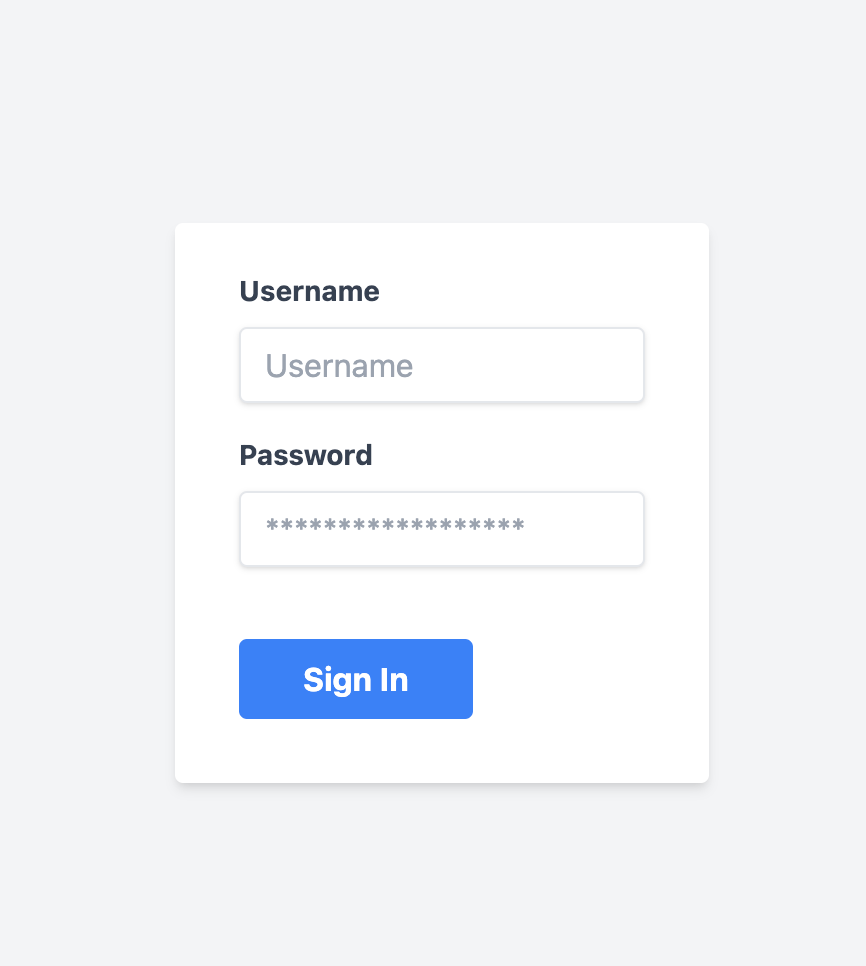
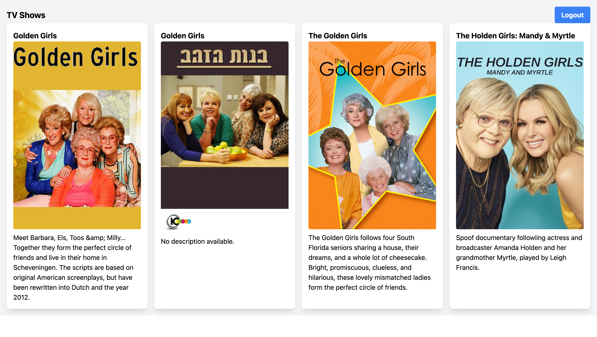

#This project uses the TVMaze.com's Open API to fetch & display the data in the form of listing cards (using Tailwind CSS) inside a Dashboard component. The listing cards won't be visible to users who are not logged in.

This project was bootstrapped with [Create React App](https://github.com/facebook/create-react-app) & uses Tailwind CSS for UI styles & Axios to fetch the data from the API & show that on the frontend.

## Available Scripts

In the project directory, you can run:

### `npm start`

Runs the app in the development mode.
Open [http://localhost:3000](http://localhost:3000) to view it in your browser.

Once you see the Login page use the following hardcoded details:

Username: test
Password: test

Login Page:

Dashboard with Logout Button:

